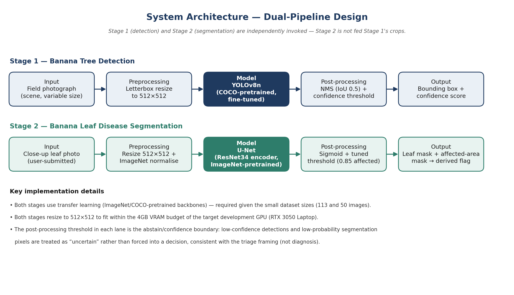
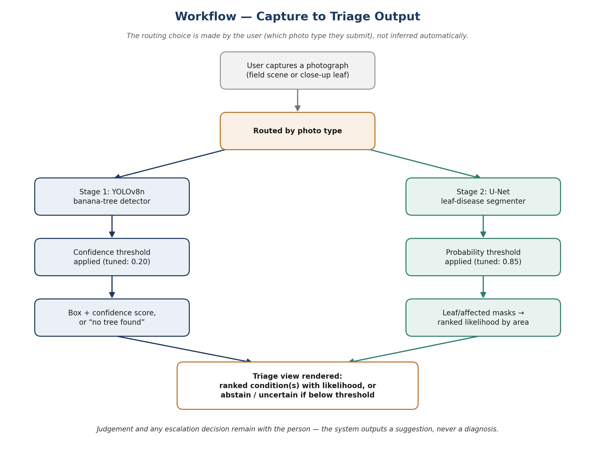
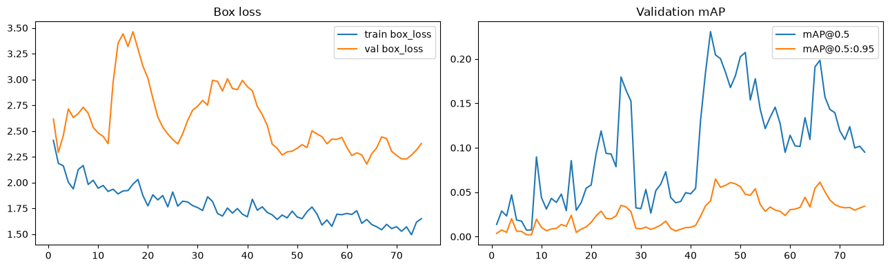
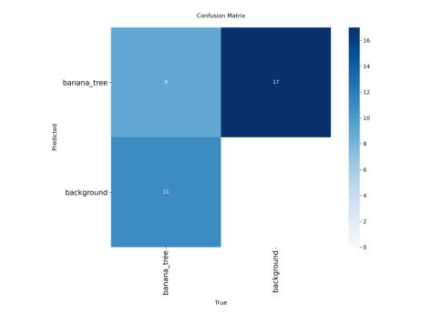
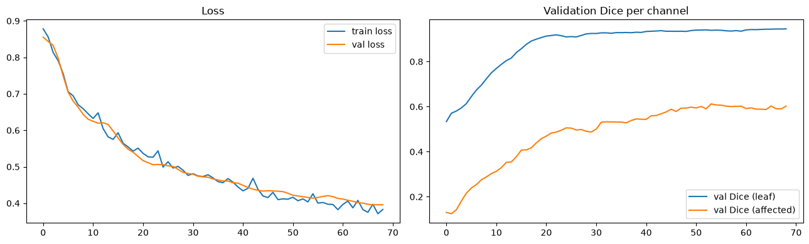
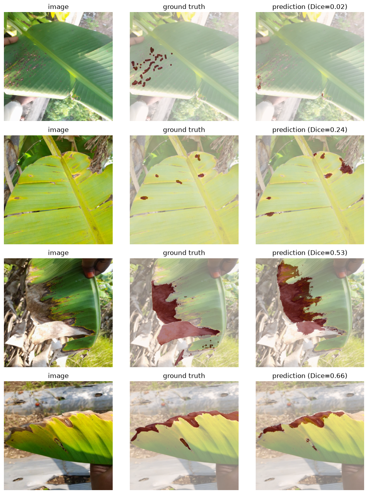

<div align="center">

# 🍌 Banana Plant Health AI
### Detection & Disease Segmentation Pipelines

*PRT691 — Artificial Intelligence Practice · Assessment 2*
*Banana Leaf Health Classification with Ranked Condition Triage*
*Group 5 · Charles Darwin University*


</div>

---

## Overview

This repository contains two independent computer-vision pipelines developed as a proof-of-concept for an on-device banana-plant health triage tool:

| | Stage 1 — Detection | Stage 2 — Segmentation |
|---|---|---|
| **Task** | Locate banana trees in a field photograph | Segment leaf region and disease-affected area on a close-up leaf photo |
| **Model** | YOLOv8n (COCO-pretrained) | U-Net, ResNet-34 encoder (ImageNet-pretrained) |
| **Output** | Bounding box + confidence score | Leaf mask + affected-area mask → derived healthy/unhealthy flag |

Both pipelines are invoked independently — Stage 2 does **not** consume Stage 1's crops — and both are engineered to fit a **4GB VRAM** budget, representative of consumer laptop / edge hardware for eventual on-device deployment.

> **This is an active, iterative development cycle.** Preliminary results below are reported honestly, including known weaknesses — see [Current Status & Limitations](#-current-status--limitations) before drawing conclusions from any single metric.

---

## 🏗️ Architecture

<p align="center"></p>

<p align="center"></p>

---

## 📁 Repository Structure

```
PRT691_AIPratices/
├── 01_banana_tree_detection.ipynb      # Stage 1 — end-to-end detection pipeline
├── 02_banana_leaf_segmentation.ipynb   # Stage 2 — end-to-end segmentation pipeline
├── assets/                             # diagrams & result figures (used in this README)
├── .gitignore
└── README.md
```

Each notebook is fully self-contained: data exploration → preprocessing → architecture → training → evaluation → inference-speed profiling → qualitative failure analysis.

---

## 🧰 Tech Stack

| | Stage 1 (Detection) | Stage 2 (Segmentation) |
|---|---|---|
| Model | YOLOv8n — [Ultralytics](https://github.com/ultralytics/ultralytics) | U-Net — [segmentation-models-pytorch](https://github.com/qubvel-org/segmentation_models.pytorch) |
| Pretraining | COCO | ImageNet |
| Augmentation | Ultralytics built-in (mosaic, HSV, geometric jitter) | Albumentations (spatial + pixel-level) |
| Loss | CIoU + DFL + BCE (Ultralytics default) | Weighted BCE + Dice, per-channel `pos_weight` from measured pixel ratios |
| Optimiser | AdamW, cosine LR, warmup | AdamW, linear warmup → cosine anneal |
| Annotation source | Roboflow COCO export | Roboflow COCO export (mixed polygon / RLE masks) |
| Dev hardware target | RTX 3050 Laptop, 4GB VRAM | RTX 3050 Laptop, 4GB VRAM |

---

## 📊 Dataset

| | Stage 1 | Stage 2 |
|---|---|---|
| Total images | 113 | 50 |
| Unique source photos | 71 (Roboflow rotation-augmentation creates near-duplicates) | 50 |
| Classes / output channels | `banana_tree` (single class — negative class pending) | `leaf`, `affected-area` (consolidated from 4 raw labelled categories) |
| Train / Val / Test | 76 / 17 / 20 — **grouped by source-photo identity** to prevent augmented duplicates leaking across splits | 35 / 7 / 8 |

---

## 📈 Preliminary Results

### Stage 1 — Detection

| Metric | Value |
|---|---|
| mAP@0.5 | **0.195** |
| mAP@0.5:0.95 | 0.065 |
| Precision | 0.222 |
| Recall | 0.385 |

<p align="center"></p>
<p align="center"></p>

<p align="center"><i>9 of 20 test-set trees correctly detected; 17 false-positive boxes on background. Read as underfitting on a small, visually diverse dataset — not a pipeline defect (see qualitative review in the notebook).</i></p>

### Stage 2 — Segmentation

| Channel | IoU | Dice | Precision | Recall |
|---|---|---|---|---|
| Leaf | **0.885** | 0.939 | 0.912 | 0.968 |
| Affected-area (default threshold 0.5) | 0.549 | 0.709 | 0.575 | 0.925 |
| Affected-area (tuned threshold 0.85) | **0.662** | — | 0.796 | 0.797 |

<p align="center"></p>
<p align="center"></p>

<p align="center"><i>Large, contiguous lesions segment well (Dice 0.53–0.66); small, scattered lesion spots are under-resolved into a single blob (Dice 0.02–0.24).</i></p>

---

## ⚠️ Current Status & Limitations

- **Detector recall is currently weak (0.385)** — most likely caused by the small, visually diverse training set (76 images spanning fruiting/non-fruiting trees at multiple zoom levels). Top priority for the next iteration.
- **Both models were trained on CPU, not GPU** — a PyTorch build mismatch (likely Python 3.14 wheel compatibility) caused the CUDA-enabled install to silently fall back to CPU. Fix identified; re-run pending.
- **Segmentation under-resolves small, scattered lesions** into a single contiguous blob rather than discrete spots.
- **Only 2 of 50 segmentation images are disease-free**, and both landed in the training split by chance — validation/test metrics currently say nothing about false-positive behaviour on genuinely healthy leaves.
- **Stage 1 negative class (`non_banana_tree`) is not yet available** — detector is single-class until that annotated data is added.

---

## 🚀 Getting Started

### Prerequisites
- Python 3.10–3.12 recommended (avoid very new releases like 3.14 until PyTorch's CUDA wheels confirm support on your platform — this caused the CPU-fallback issue noted above)
- NVIDIA GPU with 4GB+ VRAM recommended; CPU fallback works but is significantly slower

### Setup
```bash
git clone https://github.com/xaugatp/PRT691_AIPratices.git
cd PRT691_AIPratices

python -m venv .venv
.venv\Scripts\Activate.ps1        # Windows PowerShell
# source .venv/bin/activate       # macOS / Linux

pip install torch torchvision --index-url https://download.pytorch.org/whl/cu121
pip install ultralytics segmentation-models-pytorch albumentations pycocotools matplotlib scikit-learn thop
```

### Running the pipelines
1. Place your Roboflow COCO exports under `stage1_detection/` and `stage2_segmentation/` respectively (adjust the two path variables in the **Configuration** cell at the top of each notebook if your layout differs).
2. Open `01_banana_tree_detection.ipynb` and run top-to-bottom.
3. Open `02_banana_leaf_segmentation.ipynb` and run top-to-bottom — fully independent of Stage 1.

---

## 🗺️ Roadmap

- [ ] Fix CUDA training (resolve PyTorch/Python version mismatch)
- [ ] Add `non_banana_tree` negative-class data to Stage 1
- [ ] Expand healthy-leaf examples for Stage 2 (currently only 2 of 50)
- [ ] Investigate small/scattered-lesion segmentation performance
- [ ] Re-train both models on GPU and re-benchmark inference speed
- [ ] Export both models to ONNX for on-device inference testing

---

## 📄 Project Context

This repository supports **Section 5 — AI Development and Technical Progress** of the PRT691 Assessment 2 Project Progress Report (Group 5, Charles Darwin University). Full technical decision rationale and development history are documented in the accompanying report.

## 👤 Author

**Saugat Poudel** (S395696) — AI Development, Group 5, PRT691, Charles Darwin University
